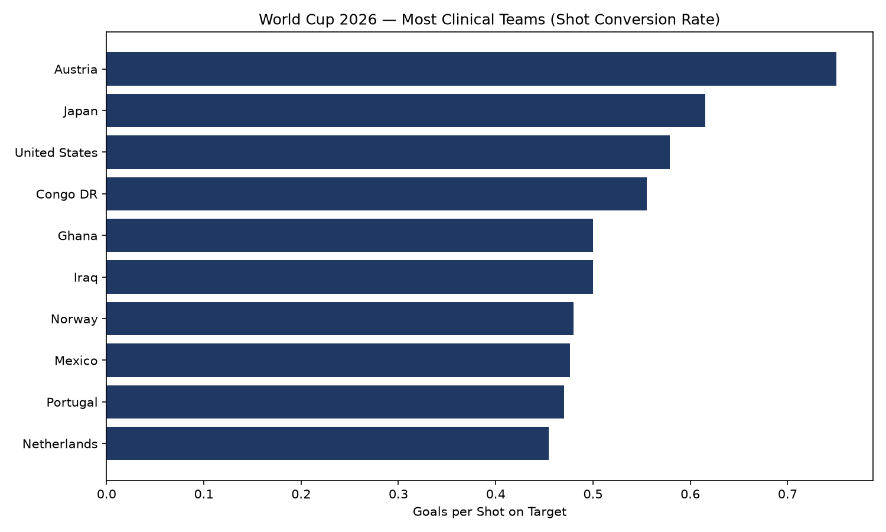

# World Cup 2026 — Team Performance Analysis

A data analysis project examining shot conversion efficiency across teams in the 2026 FIFA World Cup, built using live tournament data.

## Overview

This project pulls match-level data from the 2026 World Cup, reshapes it into team-level performance records, and calculates **shot conversion rate** (goals per shot on target) to identify which teams are most clinical in front of goal versus which are generating chances but not converting them.

## Key Finding

Austria leads the tournament with a 0.75 conversion rate (3 goals from 4 shots on target across 4 matches), followed by Japan (0.62) and the USA (0.58). By contrast, teams like the Netherlands are generating high shot volume but converting at a lower rate (0.45), suggesting a gap between chance creation and finishing quality worth investigating further (e.g., shot location, defensive pressure at the point of the shot).



## Data Source

Match-level data (results, shots, possession, cards, and more) from the [FIFA World Cup 2026 Match Data](https://www.kaggle.com/datasets/swaptr/fifa-wc-2026-matches) dataset on Kaggle, refreshed daily throughout the tournament.

## Methodology

1. **Load** — read the raw match-level CSV (one row per match, with `home_*` / `away_*` columns)
2. **Reshape** — convert to team-level long format (one row per team per match) so each team's performance can be analyzed independently of home/away splits
3. **Feature engineering**:
   - `conversion_rate` = goals ÷ shots on target
   - `rolling_form` = average goals over each team's last 3 matches
4. **Aggregate** — summarize by team across all matches played so far
5. **Visualize** — bar chart ranking teams by conversion rate

## Tech Stack

- **Python** — pandas for data cleaning/reshaping, matplotlib for visualization
- **Data**: CSV sourced from Kaggle

## Files

| File | Description |
|---|---|
| `wc2026_starter.py` | Main analysis script — load, clean, engineer features, visualize |
| `conversion_rate_chart.png` | Output chart: teams ranked by shot conversion rate |
| `data/matches.csv` | Raw match data (not included in repo — see Data Source above to download) |

## How to Run

```bash
pip3 install pandas matplotlib
python3 wc2026_starter.py
```

Note: `data/matches.csv` must be downloaded separately from the Kaggle link above and placed in a `data/` folder, since the dataset updates daily and isn't checked into this repo.

## Next Steps

- Incorporate rolling form trends heading into the knockout stage
- Compare possession share against goals scored
- Build a simple win-probability model using pre-match team stats

---

*Built as part of a career transition into sports business analytics.*
